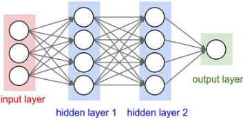

# divergent 

The zest to develop a different deep learning framework whilst understanding deep learning in one shot

## The idea

* Represent input data as multidimensional arrays    
     ```
     image might have a width, height, number of channels and intensity for each of those  

     image = [[[255, 255, 0], [127, 127, 127], ...]]
     ```

* Predict output using a (parameterized) deep neural network
    
    

* Loss function depends smoothly on the parameters + tells how good our predictions are 
    ```
    use (calculus + greediness + cleverness) to find parameters that minimize "loss" 
    ```

## The plan

* Tensors
* Loss Functions
* Layers
* Neural Nets
* Optimizers
* Data
* Training
* End-to-end example: XOR
